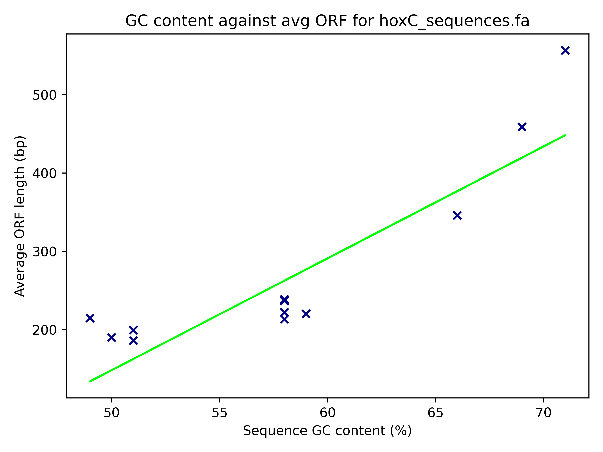
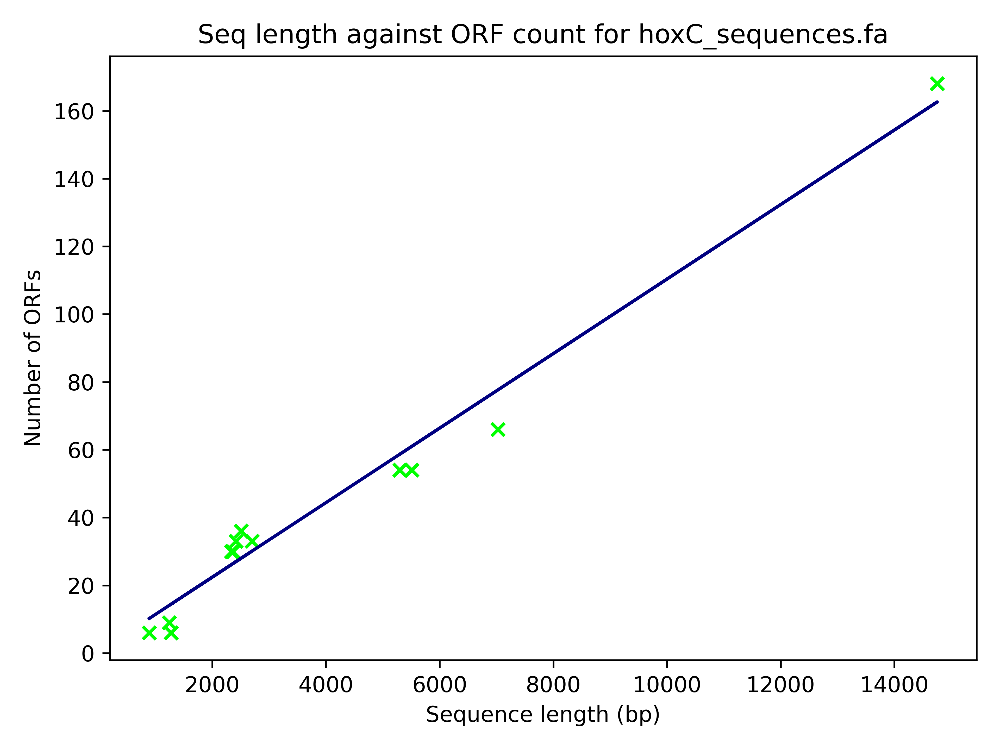

# dnaStat

## Overview

https://github.com/newcastleuniversity-computing/b6022164_csc8330_project2_2023

dnaStat is a python package for the analysis DNA sequence data. Tools can be selected to produce graphical analysis, locate ORFs and translate DNA sequences into all reading frames. 

Additional usage information can be found using the command 

```python3 dnaStat.py --help```

Dependencies can be install using the command

```pip3 install -r ./docs/requirements.txt```

The package was built as part of CSC8330 at Newcastle University.

## Arguments
| Argument | Description | Default | Required |
| -------- | ----------- | ------- | -------- |
| --help | dnaStat help information | n/a | n |
| file | input file for dnaStat analysis | n/a | y |
| out-dir | prefix for output directory | n/a | y |
| --min-orf | minimum length of ORF sequence | 90 | n |
| --basic-stat | basic statistal analysis of input sequences | False | n |
| --complex-stat | complex statistical analsysis of input sequences | False | n |
| --save-orfs | locate all ORFs in each sequence from input and save to files | False | n |
| --translate | translate each sequence from input into all reading frames and save to files | False | n |


## Examples

The file hoxC_sequences.fa is provided for example usage. The file contains 15 hoxC DNA sequences in .fa format from various organisms. At present, dnaStat is limited to .fa files. Please run all commands from the scripts directory or use relative paths. Please be careful when specifying 'out-dir' as dnaStat will overwrite any pre-existing directory of the same name.

### --min-orf

```python3 dnaStat.py hoxC_sequences.fa test --min-orf 150 <other argument>```

'--min-orf' specifies the desired minumum ORF length (bp) for analysis. It cannot be used on it's own and must be used in conjunction with another argument. An integer must be specified.

### --basic-stat

Cannot be used in conjuction with '--complex-stat'

```python3 dnaStat.py hoxC_sequences.fa test --basic-stat```

The outputs of this command are stored in ./test/stat. Files base_stats.txt and base_stats.csv contain basic summary statistics, base_frequency.png contains a stacked bar plot of base frequencies for sequences in input.


### --complex-stat

Cannot be used in conjuction with '--basic-stat'

```python3 dnaStat.py hoxC_sequences.fa test --complex-stat```

The outputs of this command are stored in ./test/stat. The directory contains the same outputs as '--basic-stat' and also GC_ORF.png and seqLength_ORF.png. Both are scatter plots of avg ORF length vs seq GC content and seq length vs ORF count respectively for sequences in input.

[](../example_images/GC_ORF.png) [](../example_images/seqLength_ORF.png)


### --save-orfs

```python3 dnaStat.py hoxC_sequences.fa test --save-orfs```

The outputs of this command are stored in ./test/orfs. Each .fa file in the directory contains all ORFs located in a sequence in input. The number of ORFs identified is dependant on '--min-orf'.

### --translate

```python3 dnaStat.py hoxC_sequences.fa test --translate```

The outputs of this command are stored in ./test/translations. Each .fa file in the directory contains all translations of a sequence in input. A rComps_{input}.fa is also produced containing the reverse complement of each sequence in input. This is stored in ./test.

## Credits

Thanks to Dr Jichun Li for all his support throughout the module.

## Future

I hope to extend the utility of dnaStat by allowing the use of differnt file formats, adding the ability to identify ORFs and make further statistical inferences from DNA sequences. I also hope to extend the package to include rnaStat, a statistical analysis tool for RNA sequneces.


